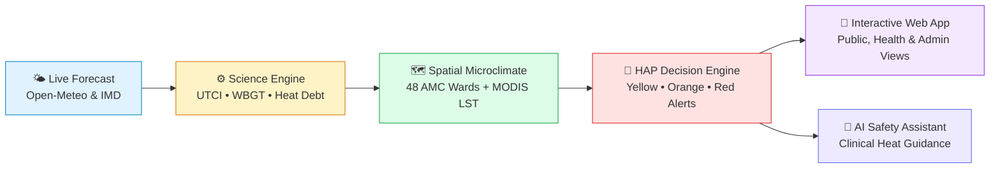

# 🌡️ HeatLens

<div align="center">

[](https://sih.gov.in)
[](https://fastapi.tiangolo.com)
[](https://react.dev)
[](https://www.typescriptlang.org)
[](https://www.docker.com)
[](LICENSE)

**Hyperlocal Heatwave Early-Warning & Decision Support System for Ahmedabad**  
*Problem Statement: 26083 · Team Hydra*

[⚡ Quick Start](#-quick-start) • [🗺️ Features](#-key-features) • [🔬 Science Engine](#-science-engine) • [📡 API Reference](#-interactive-api-reference) • [🐳 Docker](#-docker-deployment)

</div>

---

## 💡 What is HeatLens?

Standard weather apps report a single temperature for an entire city (e.g. *"Ahmedabad 42°C"*). But heat does not treat everyone equally:
- Dense informal settlements can be **3–5°C hotter** than green residential zones due to the Urban Heat Island (UHI) effect.
- Nighttime temperatures prevent physiological recovery, accumulating a **"Heat Debt"** that drastically spikes mortality.
- High humidity stops sweat from evaporating, making 38°C lethal even when conventional thresholds don't trigger.

> **HeatLens transforms raw meteorological forecasts into actionable human thermal stress metrics, ward-by-ward vulnerability maps, and automated Heat Action Plan (HAP) advisories.**



---

## ⚡ Quick Start

Get the full application running locally in **less than 2 minutes**.

### Prerequisites
- **Python 3.12+**
- **Node.js 20+** and **npm**

---

### Step 1: Start the Backend API

```bash
# Install Python runtime dependencies
pip install -r backend/requirements-runtime.txt

# Launch FastAPI server
uvicorn app.main:app --app-dir backend --port 8000
```
> 🚀 API is now live at: [`http://localhost:8000`](http://localhost:8000)  
> 📖 Interactive Swagger docs at: [`http://localhost:8000/docs`](http://localhost:8000/docs)

---

### Step 2: Start the Web Dashboard

Open a new terminal window:

```bash
# Navigate to frontend and install dependencies
cd frontend
npm install

# Start Vite development server
npm run dev
```
> 🌐 Dashboard is now live at: [`http://localhost:5173`](http://localhost:5173)

---

## 🐳 Docker Deployment (One-Click)

Run both the frontend and backend in a unified, production-ready container:

```bash
# Build the image
docker build -t heatlens .

# Run container on port 8000
docker run -p 8000:8000 heatlens
```

Visit [`http://localhost:8000`](http://localhost:8000) to view the complete integrated application.

---

## 🗺️ Key Features & Views

Explore the HeatLens dashboard pages designed for municipal decision-makers, health workers, and citizens:

| View | Route | What it delivers |
|---|---|---|
| **Executive Overview** | `/` | Real-time citywide alert status, 5-day outlook, highest-risk wards, and instant action items. |
| **5-Day Thermal Forecast** | `/forecast` | Hourly progression of Universal Thermal Climate Index (UTCI), solar radiation, and wet bulb globe temperature. |
| **Ward Microclimate Map** | `/map` | Interactive Leaflet map of all 48 Ahmedabad Municipal Corporation (AMC) wards with MODIS satellite temperature deltas. |
| **Human Heat Stress** | `/heat-stress` | Physiological breakdown: Core body temperature simulation, PHS (ISO 7933), and nocturnal heat debt accumulation. |
| **Targeted Advisories** | `/advisory/:ward` | Automated SMS, WhatsApp, and public broadcast templates tailored to specific ward vulnerability profiles. |
| **Intervention Simulator** | `/interventions` | *"What-if"* policy modeling: see the cooling effect of adding cool roofs, misting stations, or urban tree canopy. |
| **Public Citizen Portal** | `/public/:ward` | Mobile-friendly, plain-language heat risk warnings and cooling center navigators for citizens. |
| **Clinical AI Assistant** | Floating Widget | Safety-grounded AI chatbot providing verified heat exhaustion & stroke medical advice (NDMA guideline compliant). |

---

## 🔬 Science Engine

HeatLens is powered by a multi-tiered thermal physics and epidemiologically calibrated ensemble:

```
htsi/
├── plan_a_standard_metrics.py   # Liljegren WBGT, UTCI (Broede 2012), Humidex, NWS Heat Index
├── plan_b_htsi.py               # Hyperlocal Thermal Stress Index (multi-factor composite)
├── plan_c_heat_debt.py          # Nocturnal non-recovery & multi-day accumulated heat debt
└── plan_d_ensemble.py           # Calibrated ensemble fitted on Ahmedabad mortality records
```

### 🏷️ Transparent Evidence Badges
Every data point in the user interface displays its scientific provenance:
- <kbd>🟢 MEASURED</kbd> : Real-world observation (NOAA GSOD airport thermometer, MODIS satellite raster).
- <kbd>🔵 PUBLISHED</kbd> : Derived from peer-reviewed scientific literature (de Bont et al., Azhar et al.).
- <kbd>🟡 MODELLED</kbd> : Validated biophysical or numerical model output (ERA5 reanalysis, UTCI physics engine).
- <kbd>🟣 PREVIEW</kbd> : Predictive simulation or intervention scenario.

---

## 📡 Interactive API Reference

FastAPI provides an automatic, interactive OpenAPI explorer at `/docs`. Below are key endpoints:

<details>
<summary><b>🔍 Click to view core REST API endpoints</b></summary>

### 1. System Metadata & Health
```http
GET /api/v1/meta
```
```json
{
  "version": "1.0.0",
  "data_as_of": "2024-06-30",
  "calibration_status": "calibrated_may2010",
  "cities": 1,
  "zones": 48
}
```

---

### 2. Multi-Day Heatwave Forecast
```http
GET /api/v1/forecast?city=ahmedabad
```
Returns 5-day meteorological and thermal comfort forecast with AMC alert levels (`GREEN`, `YELLOW`, `ORANGE`, `RED`).

---

### 3. Ward Risk Breakdown
```http
GET /api/v1/risk/zones?city=ahmedabad
```
Provides risk scores, population exposure, and satellite land surface temperature offsets across all 48 wards.

---

### 4. Grounded AI Assistant Chat
```http
POST /api/v1/chat
Content-Type: application/json

{
  "message": "What should construction workers do during an orange alert in Odhav?",
  "session_id": "demo-session"
}
```

</details>

---

## 📂 Repository Structure

```
├── backend/
│   ├── app/                 # FastAPI routes, schemas, services, and precomputed ward data
│   │   ├── api/v1/          # Modular REST endpoints (forecast, risk, advisory, chat)
│   │   ├── chat/            # Safety-guarded AI assistant engine
│   │   └── data/            # 48-ward GeoJSON boundaries and calibration matrices
│   ├── rules/               # Machine-readable AMC Heat Action Plan & medical rules
│   └── requirements-runtime.txt
├── datasets/                # Runtime datasets (Open-Meteo clean history, health response)
├── deploy/                  # Production Nginx reverse-proxy configuration
├── frontend/                # React 19 + TypeScript + Vite + Tailwind CSS dashboard
│   ├── public/              # Icons, badges, and monuments assets
│   └── src/                 # Reusable components, interactive maps, and page views
├── htsi/                    # Pure-Python science engine (Plans A through D)
├── results/                 # Calibrated model parameters and benchmark verification reports
├── Dockerfile               # Multi-stage production container build
├── docker-compose.yml       # Full stack container orchestration
└── README.md
```

---

## ❓ Frequently Asked Questions (FAQ)

<details>
<summary><b>Q: Does this project require an active internet connection to test?</b></summary>

> **No!** HeatLens includes precomputed hourly reanalysis datasets and ward parameters in `results/` and `backend/app/data/`. The full dashboard works offline out-of-the-box. When internet is available, live Open-Meteo forecasts are pulled dynamically.
</details>

<details>
<summary><b>Q: How do I change the default port?</b></summary>

> Pass `--port <number>` to uvicorn:
> ```bash
> uvicorn app.main:app --app-dir backend --port 8080
> ```
> Then configure `frontend/vite.config.ts` proxy to forward `/api` requests to your selected port.
</details>

<details>
<summary><b>Q: Where can I review the real-world validation?</b></summary>

> Navigate to the **Methods & Validation** tab (`/methods`) in the running dashboard or review `results/benchmark_report.md` for historical leave-one-day-out accuracy against the 2010 Ahmedabad heatwave.
</details>

---

<div align="center">

Built with ❤️ for **Smart India Hackathon 2026** by **Team Hydra**  
*Empowering cities with climate intelligence before heat turns into harm.*

</div>
